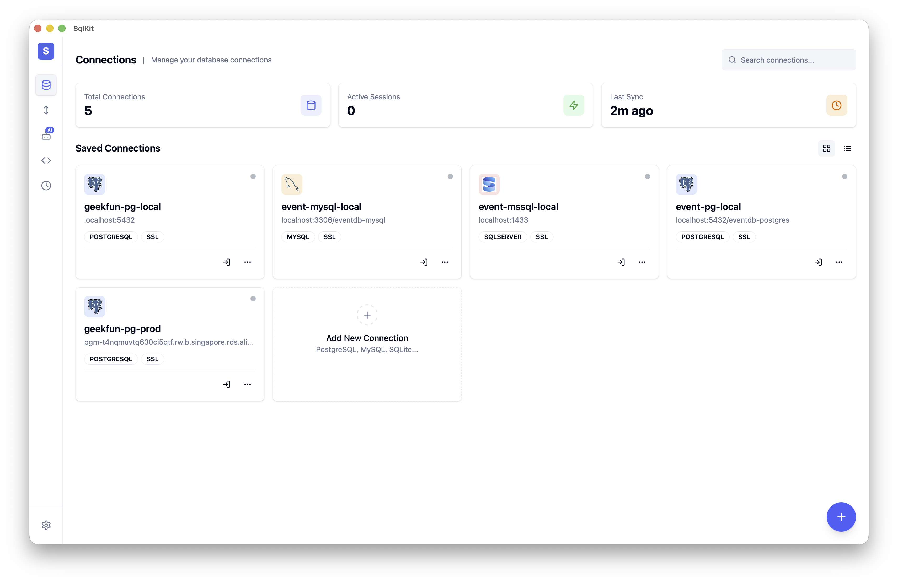

<div align="center">


# SqlKit

**Agentic 跨平台 SQL 数据库 GUI 客户端 —— 你的数据库代理，支持 40+ 种数据库。**

**隐私优先。你的数据，你的密钥。开源。**

[](https://github.com/geek-fun/sqlkit/releases)
[](https://github.com/geek-fun/sqlkit/releases)
[](LICENSE)
[](https://github.com/geek-fun/sqlkit/stargazers)
[](https://github.com/geek-fun/sqlkit/actions/workflows/node.yml)

<p>
  
  
  
  
  
</p>

[下载](https://www.geekfun.club/download) · [文档](docs/DISTRIBUTION.md) · [网站](https://www.geekfun.club) · [发布页](https://github.com/geek-fun/sqlkit/releases)

[English](README.md) · 简体中文

</div>

---

SqlKit 是一个 **Agentic 数据库客户端** —— 它不仅执行 SQL，还能理解你的数据库并替你操作。用自然语言描述你的需求，Agent 就会帮你写查询、检查 Schema、优化 SQL 并返回结果。基于 Tauri（Rust）构建，非 Electron，取代 DBeaver、Navicat、DataGrip 等臃肿客户端。

<p align="center">
  
</p>

<p align="center">
  
  
  
  
  
  
  
  
  <br/>
  
  
  
  
  
  
  
  
  <br/>
  
  
  
  
  
  
  
  
  
  
</p>

## 为什么选择 SqlKit？

<table>
  <tr>
    <td width="50%">
      <h3>🦀 Tauri 原生，非 Electron</h3>
      <p>基于 Rust + Tauri v2 构建 —— 无 Electron 臃肿，无需 JRE。原生性能，体积小巧。DBeaver 需要 Java 运行时；DataGrip 需要 JetBrains 运行时；TablePlus 仅限 macOS。SqlKit 开箱即用，无额外依赖。</p>
    </td>
    <td width="50%">
      <h3>🤖 Agentic 数据库客户端</h3>
      <p>用自然语言描述你的需求 —— Agent 帮你写查询、检查 Schema、优化慢 SQL、分析执行计划并返回结果。这不只是简单套上 AI 的查询编辑器，而是一个真正理解你的数据库并替你操作的智能代理。兼容 OpenAI、Anthropic、DeepSeek 和 Ollama。自带密钥。</p>
    </td>
  </tr>
  <tr>
    <td>
      <h3>🗄️ 40+ 数据库，一个工具</h3>
      <p>PostgreSQL、MySQL、Oracle、SQL Server、SQLite、DuckDB、ClickHouse、Firebird、MariaDB、CockroachDB、Redis、TiDB、OceanBase、Snowflake、DB2、H2、Trino 等 —— 通过原生、PG 协议兼容、MySQL 协议兼容、JDBC 桥接和 HTTP 五种适配策略，统一界面无缝切换。</p>
    </td>
    <td>
      <h3>🔒 隐私优先，安全可靠</h3>
      <p>凭据经操作系统密钥链加密存储。支持 SSH 隧道安全远程连接。无遥测。完全离线可用 —— 你的凭据和查询记录不会离开你的电脑。</p>
    </td>
  </tr>
</table>

## 功能特性

### Agentic SQL 助手

用自然语言描述你的需求 —— Agent 帮你写查询、检查 Schema、更新数据、优化 SQL 并返回结果。这是一个通过对话替你操作数据库的智能代理。

- **查询生成** — 自然语言转 SQL
- **Schema 检查** — Agent 读取并解释数据库结构
- **数据操作** — 通过对话完成 CRUD、Schema 探索、批量操作
- **SQL 优化** — 重写慢查询，提升性能
- **执行计划** — 可视化查询执行过程
- **错误修复** — Agent 诊断并修复 SQL 错误
- **安全机制** — 破坏性操作需确认；凭据不暴露给 LLM
- **支持的提供商** — OpenAI、Anthropic、DeepSeek、Ollama

### 数据工作室

基于 Monaco（VS Code 引擎）的全功能 SQL 编辑器，支持语法高亮、自动补全和多标签页。

- **Monaco 编辑器** — VS Code 级别的 SQL 编辑体验
- **多标签页** — 同时处理多个查询
- **查询历史** — 自动保存、可搜索、可回放
- **结果表格** — 分页、排序、支持行内编辑
- **导出** — 以 CSV、JSON、Markdown 格式导出结果

### 多数据库支持

SqlKit 支持 **40+ 种数据库**，通过四种适配策略覆盖：

| 策略 | 数据库 |
|------|--------|
| **原生** (Rust) | PostgreSQL、MySQL、SQL Server、SQLite、DuckDB、ClickHouse、Firebird、Oracle、RQLite、Turso |
| **PG 协议兼容** (复用 PostgreSQL 适配器) | CockroachDB、Redshift、YugabyteDB、TimescaleDB、KingbaseES、GaussDB、HighGo、OpenGauss、GBase8c、QuestDB、Vastbase、YashanDB 等 |
| **MySQL 协议兼容** (复用 MySQL 适配器) | MariaDB、TiDB、OceanBase、TDSQL、PolarDB、DM8、Doris、SelectDB、StarRocks、Databend、GoldenDB、ManticoreSearch 等 |
| **JDBC 桥接** (Java) | DB2、H2、Snowflake、TDengine、Hive、Databricks、Hana、Teradata、Vertica、Exasol、BigQuery、Informix、Cassandra 等 |
| **HTTP 桥接** | Trino、Presto |

### Schema 浏览器

可视化的树形结构浏览和管理数据库对象。

- **数据库树** — 浏览数据库、Schema、表、视图、列、索引
- **DDL 查看器** — 查看任意对象的 CREATE 语句
- **对象搜索** — 跨 Schema 快速查找表、视图和存储过程
- **表信息** — 列类型、可空、默认值、主键、外键一览

### 数据操作

- **导入 / 导出** — 以 CSV、JSON 格式跨数据库传输数据
- **数据迁移** — 在不同数据库引擎之间迁移数据
- **批量操作** — 批量处理大规模数据集

### 安全与连接

- **SSH 隧道** — 支持密钥和密码认证的安全连接
- **加密存储** — 凭据经系统密钥链加密（macOS Keychain、Windows Credential Manager、Linux Secret Service）
- **SSL/TLS** — 支持数据库加密连接
- **自动重连** — 弹性连接管理

### 跨平台

- **macOS**（Apple Silicon 和 Intel）— 原生 `.dmg` 安装包
- **Windows** — `.exe` 安装包
- **Linux** — `.AppImage` 和 `.deb` 安装包

## 安装

<a href="https://www.geekfun.club/download">
  <picture>
    <source media="(prefers-color-scheme: dark)" srcset="https://img.shields.io/badge/Download-macOS_|_Windows_|_Linux-orange?style=for-the-badge&logo=download&logoColor=white">
    
  </picture>
</a>

**macOS** — `SqlKit_*_universal.dmg`（Apple Silicon & Intel）或 `SqlKit_universal.app.tar.gz`

**Windows** — `SqlKit_*_x64-setup.exe` 或 `SqlKit_*_x64_en-US.msi`

**Linux** — `SqlKit_*_amd64.AppImage` | `SqlKit_*_amd64.deb` | `SqlKit-*_x86_64.rpm`

> 所有安装包均已签名并可校验 checksum。前往[官方网站下载](https://www.geekfun.club/download)或[浏览 GitHub Releases](https://github.com/geek-fun/sqlkit/releases)。

## 开发

### 环境要求

- [Node.js](https://nodejs.org/) >= 18
- [Rust 工具链](https://www.rust-lang.org/tools/install)

**Linux (Ubuntu/Debian):**

```bash
sudo apt-get install -y libgtk-3-dev libwebkit2gtk-4.1-dev libayatana-appindicator3-dev librsvg2-dev libssl-dev
```

**macOS:**

```bash
xcode-select --install
```

**Windows:** 安装 [Microsoft C++ Build Tools](https://visualstudio.microsoft.com/visual-cpp-build-tools/)

### 快速开始

```bash
npm install
npm run tauri dev
```

### 脚本

| 命令 | 说明 |
|------|------|
| `npm run dev` | 启动 Vite 开发服务器 |
| `npm run build` | 构建前端生产版本 |
| `npm run lint:check` | 运行 ESLint 检查 |
| `npm run lint:fix` | 自动修复 lint 问题 |
| `npm test` | 运行前端测试 |
| `npm run tauri dev` | 启动 Tauri 开发模式 |
| `npm run tauri build` | 构建 Tauri 应用 |

### 构建说明

详细构建要求请参考 [BUILD.md](BUILD.md)。

## 技术栈

| 层 | 技术 |
|----|------|
| 框架 | [Tauri v2](https://tauri.app/) (Rust) |
| 前端 | [Vue 3](https://vuejs.org/) + [TypeScript](https://www.typescriptlang.org/) |
| UI | [shadcn-vue](https://www.shadcn-vue.com/) + [UnoCSS](https://unocss.dev/) |
| 编辑器 | [Monaco Editor](https://microsoft.github.io/monaco-editor/) |
| 数据库 | [sqlx](https://github.com/launchbadge/sqlx) + 各引擎驱动 |

## 常见问题

<details>
<summary><strong>SqlKit 是免费的吗？</strong></summary>
是的。SqlKit 采用 Apache 2.0 许可证开源，所有功能免费使用。
</details>

<details>
<summary><strong>SqlKit 会上传用户数据吗？</strong></summary>
不会。SqlKit 不收集任何遥测数据。自动更新功能会检查 GitHub 上的新版本 —— 你可以在设置中关闭。你的凭据和查询记录始终留在本地。
</details>

<details>
<summary><strong>SqlKit 可以在离线环境下使用吗？</strong></summary>
可以。桌面应用完全离线可用。AI 功能需要网络访问模型端点（或通过 Ollama 使用本地模型）。
</details>

<details>
<summary><strong>SqlKit 和 DBeaver、TablePlus、DataGrip 有什么不同？</strong></summary>
SqlKit 是基于 Tauri（Rust）的原生应用 —— 无需 Java 运行时，没有 Electron 的开销。AI 功能内建而非插件形式，支持 40+ 数据库，一套二进制文件即可在 macOS、Windows 和 Linux 上运行。隐私优先，凭据经本地加密存储。
</details>

<details>
<summary><strong>SqlKit 支持哪些数据库？</strong></summary>
PostgreSQL、MySQL、Oracle、SQL Server、SQLite、DuckDB、ClickHouse、Firebird、MariaDB、CockroachDB、Redis、TiDB、OceanBase、Snowflake、DB2、H2、Trino 等 20+ 种。完整列表请参见<a href="#多数据库支持">多数据库支持</a>章节。
</details>

<details>
<summary><strong>如何报告 Bug 或请求新功能？</strong></summary>
请在 <a href="https://github.com/geek-fun/sqlkit/issues">GitHub Issues</a> 提交。
</details>

## 社区

<p align="center">
  
  &nbsp;&nbsp;&nbsp;&nbsp;&nbsp;
  
</p>

<p align="center">
  <a href="https://discord.gg/5NSUyPK2E"></a>
  &nbsp;&nbsp;&nbsp;
  <a href="https://x.com/geekfun_club"></a>
  &nbsp;&nbsp;&nbsp;
  <a href="https://www.youtube.com/@geekfun-club"></a>
  &nbsp;&nbsp;&nbsp;
  <a href="https://github.com/geek-fun"></a>
</p>

## 赞助

<p align="center">
  
  &nbsp;&nbsp;&nbsp;&nbsp;&nbsp;
  <a href="https://github.com/sponsors/geek-fun"></a>
</p>

## Star 历史

<a href="https://www.star-history.com/?repos=geek-fun%2Fsqlkit&type=date">
  <picture>
    <source media="(prefers-color-scheme: dark)" srcset="https://api.star-history.com/chart?repos=geek-fun/sqlkit&type=date&theme=dark" />
    <source media="(prefers-color-scheme: light)" srcset="https://api.star-history.com/chart?repos=geek-fun/sqlkit&type=date" />
    
  </picture>
</a>

## 许可证

[Apache 2.0](LICENSE) © GEEKFUN
